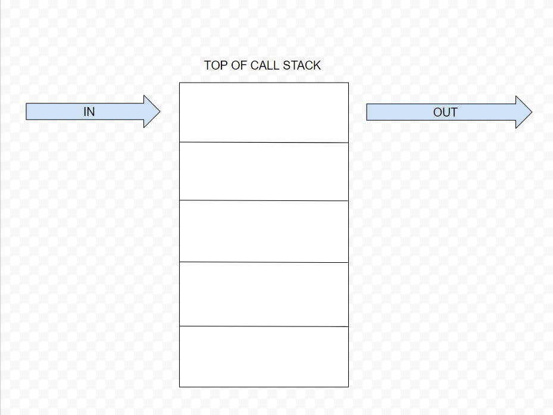

## Reading Class 10 In memory storage

## Why is this important?

- Understanding the JS Call stack is important for function invocation order, debugging and preventing stack overflow.

- Reference errors tell the dev what exactly is wrong.

## Understanding the JavaScript Call Stack

1. A 'call' is the same thing as invoking a function.

2. Synchronous functions are invoked one at a time.

3. Last In First Out.  "The last function that gets pushed into the stack is the first one out when the function returns" [source](https://www.freecodecamp.org/news/understanding-the-javascript-call-stack-861e41ae61d4)

4. 

5. "A stack overflow occurs when there is a recursive function (a function that calls itself) without an exit point. The browser (hosting environment) has a maximum stack call that it can accomodate before throwing a stack error." [source](https://www.freecodecamp.org/news/understanding-the-javascript-call-stack-861e41ae61d4)

## JavaScript error messages 

1. Reference error: Trying to use a variable that isn't dclared yet. 

2. Syntax error: There is an error in the syntax...

3. Type error: When the datatype of whatever you are trying to use isn't compatible.

4. A breakpoint is a line in the code that stops the application from running past it inorder to debug.

5. Creates a breakpoint.