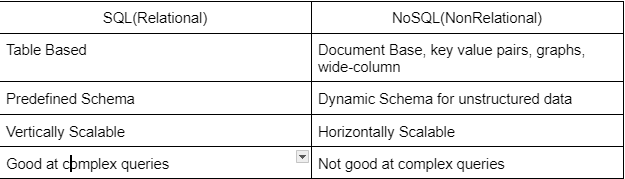

# Class 11 Reading MongoDB and Mongoose

## Why is this important?

- SQL and NoSQL are important for the utilization and storage of the data that the developer can provide to the user.

## nosql vs sql

1. Table based data is a good fit for a SQL db.

2. A table that logs members at a gym with their information.

3. Documents, key-value pairs, graph databases or wide-column stores are a good fit for NoSQL

4. Similar to my sql example but stored into objects with each member having their own object.

5. NoSQL databases are better fits for heirarchical data storage.

6. Depends if you want to vertically scale(SQL) or horizontally scale(NoSQL).

## sql vs nosql (video)

1. SQL stands for structured query language.

2. A relational database is a db that supports certain assumptions and supports SQL. (Multiple Tables that are related)  Uses a structure know as a rleational model(Consists of rows and columns)

3. Tables, (Relational Model) ^

4. Schema describes what will go inside the table we are using

5. NoSQL databases work with unstructured data(Non relational data models) and are schema-less.

6. They are schema-less databases, so the contents don't have to have the same 'format'.  They also are non relational.  (Contents look like JSON files)

7. Collections(Similar to tables), Documents(similar to rows, don't have to use the same schema) are inside MongoDB.

8. MongoDB is more flexible because it is NoSQL and is schema-less, meaning each set of content doesn't have to have the exact same format.

9. Can't rely on your record to have a certain field (schema-less).  

## Questions I have

- No questions