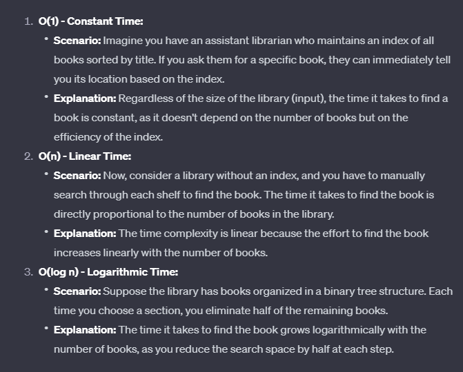

# Readings: Ten Thousand Game 1

## Why is this important?

- Finding random numbers/values could be useful for randomizing output given back to the user.

- Risk Analysis mitigates errors/failures that might arise in the dev environment.

- Test Coverage ensures devs are test their code and maximizing their coverage enough.  Could be misleading if a dev is just chasing the highest coverage numbers and not actually implementing thoughtful tests.

- Big O notation explains the efficiency of an algorithm and how it might affect/utilize given resources.

## Reading Questions

1. `randint()` will generate a random number/numbers within a given range.  The two parameters are the start of the range and the end of the range.  The `choice()` function selects a random value from a collection object(list, set, tuple).  It takes a collection object as an input argument.  The most common functions are: `randint()`, `random()`, `choice()`, `randrange()` and `shuffle()`.

2. "Risk analysis is the process of identifying the risks in applications or software that you build and prioritizing them to test."  [source](https://www.edureka.co/blog/risk-analysis-in-software-testing/).  The key steps to take in risk analysis are: Searching the risk, Analyzing the mpact of each individual risk and measures for the risk identified.

3. Test coverage is used to make sure your code has been tested thoroughly and identifying any untested code.  It can be a misleading metric if individuals are chasing numbers, they can just fluff the test and implement low quality testing.  

4. Big O notation is a way of quantifying the complexity of an application based on the efficiency and performance.  "Worst case performance" - Chatgpt.  I asked chatgpt to give me a real world example and here is what it came up with:

## Things I want to know more about

- Still trying to wrap my head around Big O