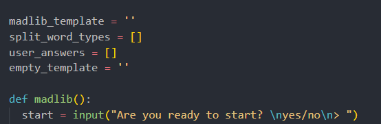

# Readings: Ten Thousand 2

## Why is this important?

- Understanding global, local scope is important for accessing variables, functions etc within your code and limiting the amount of times you have to rewrite code.

- Big O notation is important for resource management and efficiency of code.

## Reading Questions

1. Code within the global scope is available to be used by all of your code(Top-most scope) within the file while local can only be used within the scope(function, class etc.) It all depends on where it's declared. Below is an example, the top text is declared globally while the `start` variable is local to the function it's in.

2. The `global` keyword will ensure a variable is mapped to global/module scope that it's defined in in case it might need to accessed within another function, while `nonlocal` limits the use of the variable to within a nested function in order to reuse variable names...  

3. Big O notation conveys an algorithms complexicity/efficiency based on how it processes the code.  It's important for resource utilization and can be a good hint at if code needs to be refactored or made more efficient.

4. In python you can import the `random` library and use the `randint(x,x)` function to create a variable with a random number between the range you give it.  Ex: `dice_roll = tuple(random.randint(1,6))`. In order to find the probability you can create a loop that will loop 20 times, and call a function that "rolls" the dice. On each roll, append the number to an empty list and count how many times you rolled your desired number

## What do I want to know more about

- Are nonlocal variables able to change within their nested function?