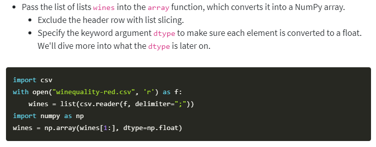

# Data Analysis

## Why is this important?

- Jupyterlab and notebook are great for having a computing environment with a user friendly interface that allows for multiple 3rd party extensions.

- NumPy and NumPy arrays allows for computation of massive amounts of data from matrixes, vectors and more than 3 dimensional arrays.  NumPy also comes with built in functions to manipulate the data inside of huge arrays.  

## Reading Questions

1. JupyterLab is an editing environment that allows for running code interactively, kernel-backed documents which enable code in any text file to be run interactively in any Jupyter kernel, Notebook cell outputs can be mirrored into their own tab and multiple views of documents with different editors which enable live editing of docs. reflected in other viewers. [source](https://jupyterlab.readthedocs.io/en/stable/getting_started/overview.html) JupyterLab differs from notebook by offer a more flexible interface and more extensions with the ability to integrate more tools.  

2. The main functionalities of the NumPy library are multidimensional arrays like one dimensional and two dimensional(matrix) for storing data.  NumPy library is useful for anything that deals with large datasets stored in arrays.  A limitation of NumPy is that all elements inside of the array must be the same datatype.  

3. A 2-dimensional array is made of rows and columns and is often referred to as a Matrix while a 1-dimensional array A.K.A Vector is almost like a column from the Matrix.  You can create a NumPy array with the `.array()` function.  Ex.  `golf_clubs = np.array(golf_clubs[1:], dtype=np.float)`. You can also use NumPy to read files into your code with `.genfromtxt()`.  You can use arithmetic operators with NumPy to apply the operation to each element inside of the array and between arrays. Use `.vstack()` to vertically stack multiple arrays.

## What do I want to know more about?

- Is Jupyter mostly for documentation?

- Is there a max. amount of data that a NumPy array can handle?