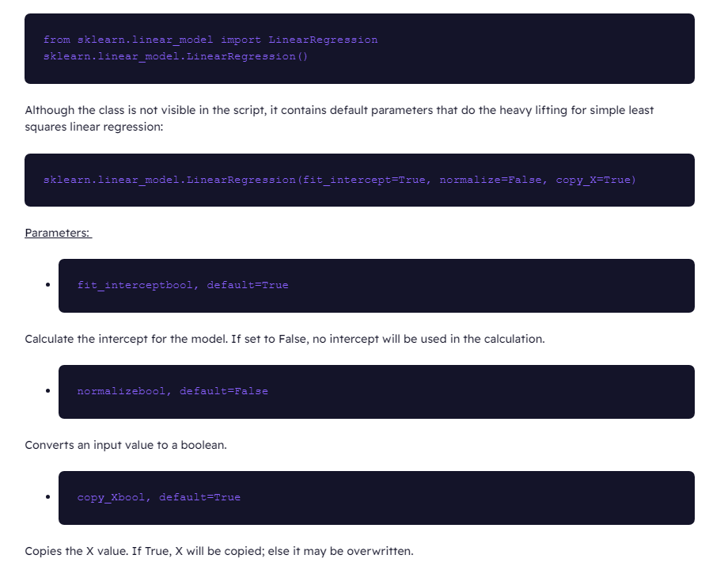
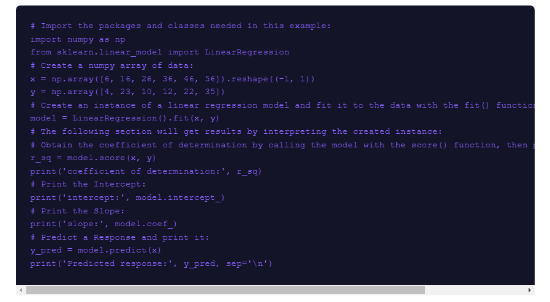

# Readings Class 13 Linear Regressions

## Why is this important?

- Linear regression is important for understanding data trends

- Train test split evaluates the performance of a ML model demonstrating if it handles well with new unseen

## Reading Questions

1. "Linear Regression is the straight line that best fits a set of scattered data points".  "Linear regression is a fundamental ML algorithm due to its comparatively simple and core properties" [source](https://www.activestate.com/resources/quick-reads/how-to-run-linear-regressions-in-python-scikit-learn/)

- First you need to import the LinearRegression Class and define it

- Then you create the actual mode by defining arrays based on the x and y axises of your data and creating an instance of the linear regression class with the x and y data.  You can then print the coefficient, Intercept, Slope and a response to it.

[source for images](https://www.activestate.com/resources/quick-reads/how-to-run-linear-regressions-in-python-scikit-learn/)

3. The purpose of splitting the dataset into train and test sets is to simulate how a model would perform on new/unseen data. [source](https://builtin.com/data-science/train-test-split) It contributes to gauging how well a ML model will react to new data and predicting outcomes of data.

## Things I want to know more about

- N/A