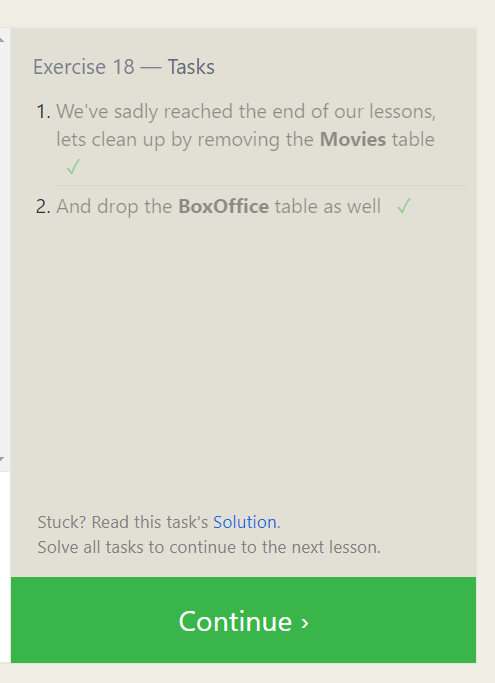

# Intro to SQL 

- SQL stands for Structured Query Language

- 'Used to manage and query a database' [source](https://www.computer-pdf.com/3-sql-database-tutorial-for-beginners)

- SQL Databases are relational, meaning that they have each record has a certain template that is has to follow

- SQL Databases are conveyed as tables with rows and columns.

- Some SQL database systems are MySQL, PostgreSQL and Oracle

- Uses keywords like `Update, insert, delete, create` to allow devs to manipulate data within the database.

